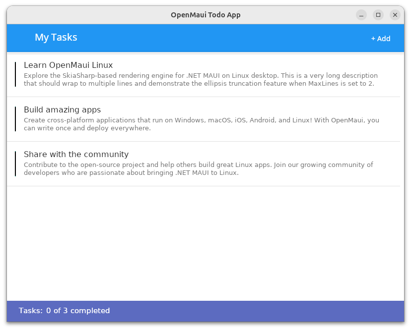
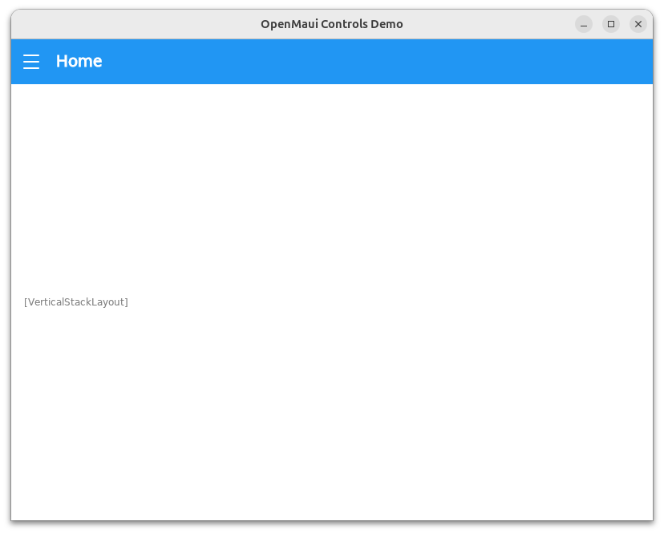

# OpenMaui Linux Samples

Sample applications demonstrating [OpenMaui Linux](https://git.marketally.com/open-maui/maui-linux) - .NET MAUI on Linux.

## Samples

| Sample | Description |
|--------|-------------|
| [TodoApp](./TodoApp/) | Full-featured task manager with NavigationPage, XAML data binding, and CollectionView |
| [ShellDemo](./ShellDemo/) | Comprehensive control showcase with Shell navigation and flyout menu |

## Requirements

- .NET 9.0 SDK
- Linux with X11 (Ubuntu, Fedora, etc.)
- SkiaSharp dependencies: `libfontconfig1-dev libfreetype6-dev`

## Quick Start

```bash
# Clone the samples
git clone https://git.marketally.com/open-maui/maui-linux-samples.git
cd maui-linux-samples

# Run TodoApp
cd TodoApp
dotnet run

# Or run ShellDemo
cd ../ShellDemo
dotnet run
```

## Building for Deployment

```bash
# Build for Linux ARM64
dotnet publish -c Release -r linux-arm64

# Build for Linux x64
dotnet publish -c Release -r linux-x64
```

## TodoApp

A complete task management application demonstrating:
- NavigationPage with toolbar and back navigation
- CollectionView with data binding and selection
- XAML value converters for dynamic styling
- DisplayAlert dialogs
- Grid layouts with star sizing
- Entry and Editor text input



## ShellDemo

A comprehensive control gallery demonstrating:
- Shell with flyout menu navigation
- All core MAUI controls (Button, Entry, CheckBox, Switch, Slider, etc.)
- Picker, DatePicker, TimePicker
- CollectionView with various item types
- ProgressBar and ActivityIndicator
- Grid layouts
- Real-time event logging



## Related

- [OpenMaui Linux Framework](https://git.marketally.com/open-maui/maui-linux) - The core framework
- [NuGet Package](https://www.nuget.org/packages/OpenMaui.Controls.Linux) - Install via NuGet

## License

MIT License - See [LICENSE](LICENSE) for details.
